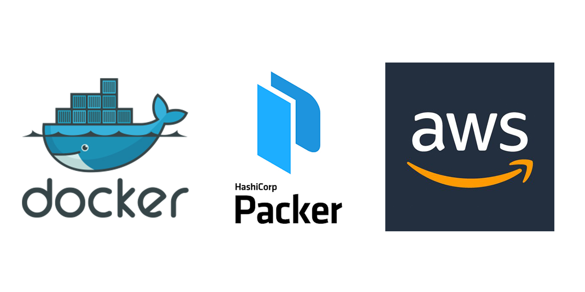

----
## Dockerised [Hashicorp's Packer](https://www.packer.io/)

Container that grabs Packer by HashiCorp and bakes [AWS](https://aws.amazon.com/) AMI.

This configuration creates a Docker container (based on Ubuntu) that downloads [Hashicorp's Packer](https://www.packer.io/). That [Packer](https://www.packer.io/) bakes AMI on [AWS](https://aws.amazon.com/).

----
##

In this example [Packer](https://www.packer.io/) bakes AMI (Ubuntu 16.04) that has web server configured to serve page on port 80 (for testing purposes).

Packer configuration file is named:

    packer_template.json

  Instance configuration script is named:

    packer_script.sh

Variables file is named:

    dev_vars.json

The Dockerfile creates a container that grabs Packer by HashiCorp and bakes AWS AMI.

This repo can be referenced in Dockerhub as a Source Repository. A path to Packer config files can be mapped for Docker. Also, the AWS credentials have to be provided so that AMI could be created. Run this setup with following command:

    docker run -d -e "AWS_ACCESS_KEY_ID=<key-id-value>" -e "AWS_SECRET_ACCESS_KEY=<secret-key-value>" -v /path/to/folder/with/packer/configuration:/usr/local/src your_dockerhub/link_to_repo
